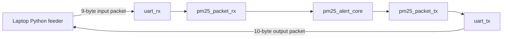

# UART Laptop Demo Design

## Purpose

This design adds a laptop-only UART wrapper around the already-verified `pm25_alert_core`. It does not change the core algorithm, constants, Python golden model, or CSV vector contract.

The intended hardware setup remains:

- laptop;
- USB cable;
- Tang Nano 9K board;
- no external LED module;
- no OLED;
- no external PM2.5 sensor;
- no ESP32;
- no extra peripherals.

## Why binary packets instead of ASCII

The FPGA wrapper uses compact binary packets to keep RTL small and deterministic. ASCII parsing would require decimal conversion, separators, error handling, and more state. That complexity belongs on the laptop, where Python can easily read CSV files and print human-readable tables.

The FPGA receives integers only:

    value_x16 = round(value_float * 16)

## Module list

| File | Module | Role |
| --- | --- | --- |
| `rtl/uart/uart_rx.v` | `uart_rx` | 8N1 UART byte receiver. |
| `rtl/uart/uart_tx.v` | `uart_tx` | 8N1 UART byte transmitter. |
| `rtl/uart/pm25_packet_rx.v` | `pm25_packet_rx` | Decodes 9-byte laptop-to-FPGA input packets. |
| `rtl/uart/pm25_packet_tx.v` | `pm25_packet_tx` | Encodes 10-byte FPGA-to-laptop output packets. |
| `rtl/top/pm25_uart_demo_top.v` | `pm25_uart_demo_top` | Generic board-independent UART wrapper around `pm25_alert_core`. |
| `demo/uart/pm25_uart_feeder.py` | Python script | Canonical CSV feeder, UART monitor, and golden-response checker. |
| `tb/verilog/tb_pm25_uart_demo_top.v` | testbench | Fast packet-level tests for packet RX/TX. |
| `tb/verilog/tb_pm25_uart_wrapper.v` | testbench | Packet-level end-to-end request/core/response contract, including invalid samples and bad checksum. |
| `tb/verilog/tb_pm25_uart_serial_top.v` | testbench | Real 8N1 stop-and-wait contract and reset regression. |

## UART packet flow

The wrapper accepts one checksum-valid decoded packet only while the response
path is free. An explicit `request_fire` event is separate from the decoded
`sample_valid` bit. The core receives
`request_fire && sample_valid_to_core`, while response capture is scheduled
from `request_fire` and the core's known registered latency. Therefore a valid
request with `sample_valid=0` still returns one response with
`result_valid=0`. UART is slow compared with the 27 MHz core clock, so no FIFO
is included in v1. The supported host contract is stop-and-wait: one request
remains outstanding until its response is received.

The frozen cases are:

- `sample_valid=1, qc_ok=1`: result valid and accepted; bias/hysteresis update
  according to core-v1.
- `sample_valid=1, qc_ok=0`: result valid, not accepted; bias holds and
  hysteresis follows the valid fused result.
- `sample_valid=0`: result invalid and not accepted; bias/hysteresis hold, but
  one golden-model diagnostic response is sent.
- bad checksum: no core request, state change, or normal response.

## Core separation

`pm25_alert_core` remains the verified arithmetic IP. The UART layer converts bytes to integer fields and integer fields back to bytes. It does not modify:

- fixed-point constants;
- adaptive-bias update arithmetic;
- alert classification;
- hysteresis behavior;
- reset behavior;
- CSV vector contract.

The core has `sample_ready = 1'b1`, so it can accept one sample per clock. The UART wrapper only presents a sample when a complete, checksum-valid input packet is decoded and the simple response path is free.

## Laptop feeder

Dry-run packet preview:

    python demo/uart/pm25_uart_feeder.py --dry-run --csv data/processed/pm25_hourly_canonical.csv --limit 5

Serial run:

    python demo/uart/pm25_uart_feeder.py --port COM4 --baud 115200 --csv data/processed/pm25_hourly_canonical.csv --delay 0.05 --log logs/uart/board_run.csv

If `pyserial` is missing, install it with:

    pip install pyserial

The script supports processed project CSV columns such as:

- `time`;
- `hour`;
- `cams_pm25`;
- `pa_pm25_hourly`;
- optional `qc_ok`.

It also supports normalized column names:

- `timestamp`;
- `hour`;
- `cams_pm25`;
- `purpleair_pm25`;
- `qc_ok`.

## Simulation

The complete Windows regression is:

    powershell.exe -NoProfile -ExecutionPolicy Bypass -File sim/scripts/run_all_tests.ps1

It verifies:

- good input packet decode;
- checksum-error rejection;
- signed int16 to signed 32-bit conversion;
- output packet byte order;
- output packet checksum;
- both valid/QC cases and both invalid/QC combinations;
- exactly one response per checksum-valid stop-and-wait request;
- bad checksum state/response hold;
- signed positive/negative arithmetic;
- bias and hysteresis hold across invalid packets;
- reset between transaction sequences;
- packet-level wrapper and real 8N1 serial paths.

The Python feeder regression also constructs an invalid request and consumes
one response matching `PM25CoreV1Fixed`.

## Tang Nano 9K mapping later

This task intentionally avoids Gowin project files and pin constraints. A later board task should:

- create the Gowin project;
- map `clk`, `rst_n`, `uart_rx`, and `uart_tx` to Tang Nano 9K pins;
- choose the real board clock/reset wiring;
- keep `pm25_uart_demo_top` as the logical top;
- avoid adding display or external sensor dependencies.

## Limitations

- No FIFO/backpressure beyond the simple UART-speed assumption.
- Host should send one sample and wait for the response before sending the next sample.
- Packet payloads use signed int16 for UART compactness. Current pilot PM2.5 and bias ranges fit.
- No board-specific constraints are included in this task.
